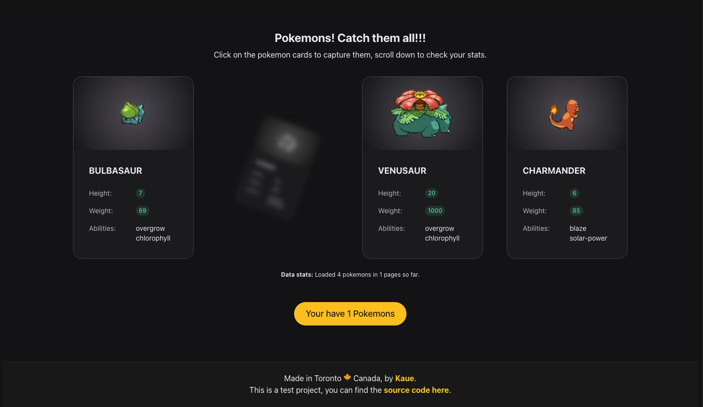

# POKEMONS

A small test project that began as an interview assignment and evolved into a Pokémon Card Game. Catch all Pokémon cards to load the next batch, it goes on forever...

## This project uses:

- **Vite**
- **React** with custom hooks and basic state management.
- **Axios**
- **Radix UI** along with with a custom CSS module for the card effects.

## Live Demo

Check the live demo on this [link](https://pokemons-jade.vercel.app/), hosted on Vercel.
